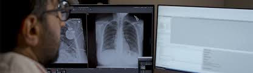
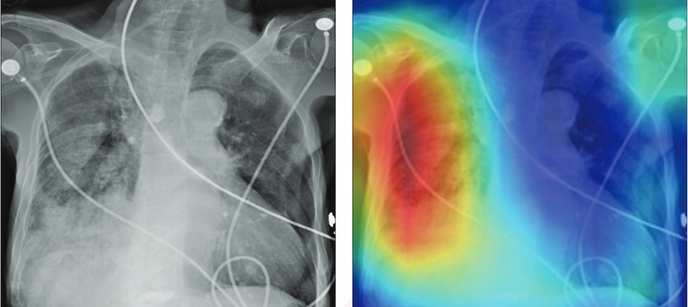
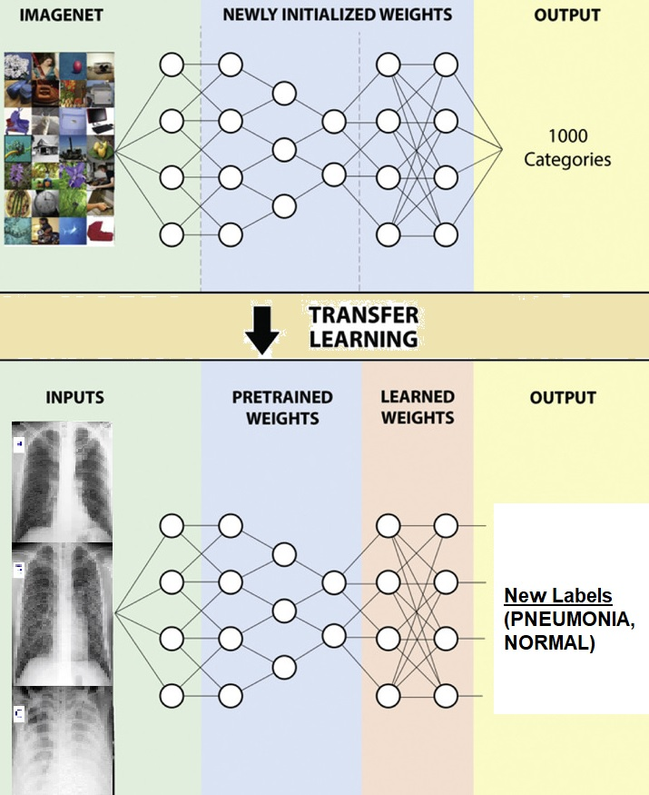
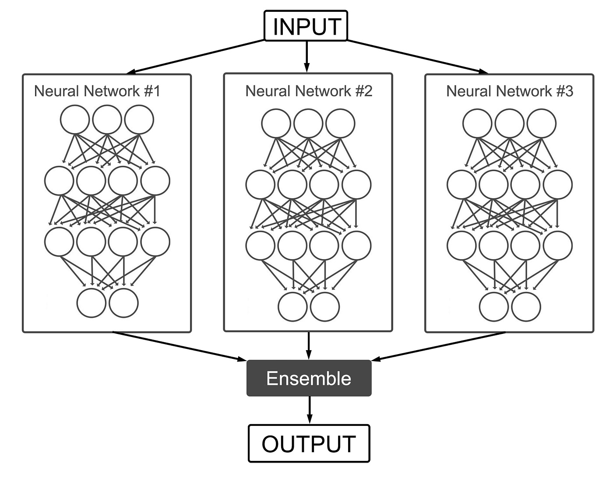
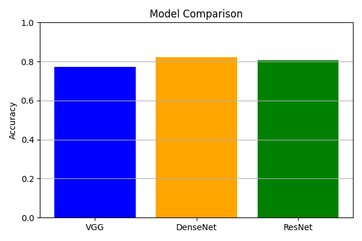
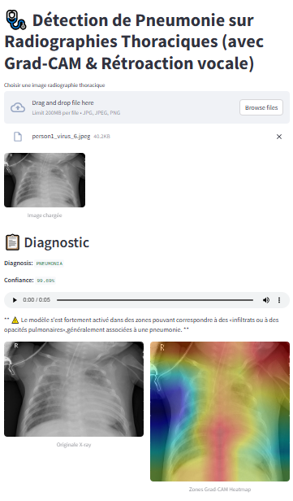
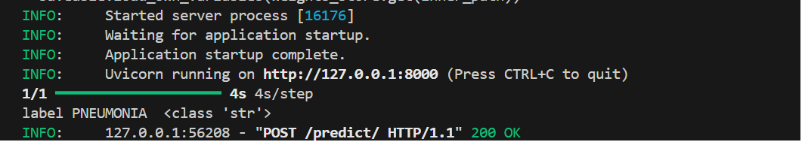
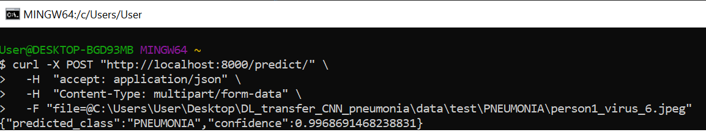

   
# 🩺 Détection de Pneumonie sur Radiographies Thoraciques utilisant le Transfer Learning (à partir de modèles pré-entraînés de type CNN)

## 🔍 Contexte
La pneumonie est une infection grave des poumons qui peut mettre la vie en danger. Un diagnostic précoce à partir de radiographies peut grandement améliorer le pronostic. Cependant, l’analyse visuelle des images est lente et sujette à l’erreur humaine. Ce projet propose une solution automatisée pour aider les professionnels de santé à diagnostiquer plus rapidement et avec plus de précision.
Les performances obtenues dans ce projet ont été atteintes grâce au transfert learning, apprentissage en ensemble et au fine-tuning des couches supérieures.

## 📚 Sommaire

  - [🧠 Présentation du Projet](#-présentation-du-projet)
  - [🧠 Choix du Modèle et préparation des images](#-choix-du-modèle-et-préparation-des-images)
  - [🧰 Technologies utilisées](#-technologies-utilisées)
  - [📁 Structure du Projet](#-structure-du-projet)
  - [🧪 Suivi des expériences avec MLflow](#-suivi-des-expériences-avec-mlflow)
  - [🚀 Lancement du projet](#-lancement-du-projet)
  - [🖼️ Test du projet avec Streamlit](#-test-du-projet-avec-streamlit)
  - [🧪 Test du projet via une API](#-test-du-projet-via-une-api)
  - [📌 Pistes d’amélioration](#-pistes-damélioration)
  - [🤝 Contributions](#-contributions)

## 🧠 Présentation du Projet

Ce projet vise à développer un modèle d’apprentissage profond capable de classifier automatiquement des radiographies thoraciques en deux catégories : Pneumonie et Normal. Il s’appuie sur des techniques de transfer learning avec des réseaux de neurones convolutifs pré-entraînés pour améliorer les performances et accélérer l'entraînement.

Comme le montre l'image suivante, le **Transfer Learning** consiste à réutiliser un modèle pré-entraîné sur ImageNet (une vaste base de données d’images annotées) comme point de départ, puis l'adapter et l'entraîner sur une autre tâche de vision (radiographies thoraciques, dans ce projet) pour avoir un nouveau modèle personnalisé à la nouvelle classification (Pneumonie et Normal, dans ce projet).

L’adaptation commence par l’ajout de nouvelles couches finales au modèle, puis différentes stratégies peuvent être appliquées aux couches préentraînées, comme le **freezing** (conservation des poids des premières couches) ou le **fine-tuning** (réentraînement partiel ou complet du réseau du modèle pré-entraîné).

 

*Crédit : (http://www.cell.com/cell/fulltext/S0092-8674(18)30154-5)*

Dans ce projet, l’**ensemble learning**, schématisé ci-dessous, est utilisé en combinant plusieurs **CNN pré-entraînés** puis adaptés à la nouvelle classification. Leurs prédictions sont ensuite agrégées (par moyennage, vote majoritaire ou stacking) afin d’améliorer la robustesse, la précision et la capacité de généralisation du modèle final.

 

*Crédit : (https://medium.com/@alexppppp/how-to-train-an-ensemble-of-convolutional-neural-networks-for-image-classification-8fc69b087d3)*

Pour assurer la traçabilité des expériences, la reproductibilité des résultats et faciliter le déploiement des modèles entraînés, ce projet s’appuie sur **MLflow**, une plateforme qui s’articule autour de quatre composants principaux :  
- **MLflow Tracking** pour le suivi des expériences,  
- **MLflow Projects** pour le packaging et l’exécution du code,  
- **MLflow Models** pour la gestion et le déploiement des modèles,  
- **MLflow Registry** pour le versioning et la gestion du cycle de vie des modèles.

## 🧠 Choix du Modèle et préparation des images

Parmi les différents modèles testés (VGG16, DenseNet121, ResNet50v2, Ensemble de modèles, ...), nous avons sélectionné DenseNet121 qui offre le meilleur compromis entre exactitude, robustesse et temps d’inférence pour l’intégration dans l’application.
Ce modèle est ensuite utilisé comme modèle final pour le déploiement via l’interface Streamlit. La figure suivante présente une comparaison entre les meilleurs modèles testés, parmi lesquels DenseNet121 se démarque comme le plus performant en terme d'exactitude(accuracy) sur les données de test.

Afin de rendre les images compatibles avec les modèles de préentraînés comme DenseNet121, qui attendent une entrée en trois canaux (RGB), les images sont converties en image couleur avec cv2.cvtColor, chaque canal contenant les mêmes valeurs issues du niveau de gris. Ensuite, les images sont redimensionnées à 224x224 pixels à l’aide de cv2.resize, une taille standard d’entrée pour la plupart des architectures convolutionnelles.

## 🧰 Technologies utilisées

Language de programmation : Python 

Framework Deep Learning : TensorFlow 

Modèles pré-entraînés : VGG16, DenseNet121, ResNet50v2.

Suivi des expériences : MLflow

Données : Chest X-Ray Images (Pneumonia) 
*https://www.kaggle.com/datasets/paultimothymooney/chest-xray-pneumonia/data*

## 📁 Structure du Projet

├── api/                   # Fast API app pour tester le projet

├── data/                   # Données (train, val, test) (ignored)

├── figures/                 # Matrice de confusion, courbes, métriques

├── notebooks/              # Notebooks Jupyter pour l'exploration et le prototypage

└── mlruns/             # Répertoire utilisé par MLflow 

├── utils/                 # Fonctions utiles en python

├── models/                 # Modèles sauvegardés

├── web_app/                 # Streamlit GUI + Grad_CAM

├── requirements.txt        # Dépendances du projet

└── README.md               # Présentation du projet

## 🧪 Suivi des expériences avec MLflow
MLflow permet de :

Suivre les métriques d'entraînement et de validation

Enregistrer les hyperparamètres et artefacts

Comparer les différents essais

Gérer les versions des modèles

Tout cela peut se faire automatiquement en utilisant:

`` mlflow.tensorflow.autolog() ``

Spécifier le nom de l'expérimentation : Experiment_Name

`` mlflow.set_experiment("Experiment_Name")``

et le nom de run : Run_Name

`` mlflow.start_run(run_name="Run_Name"):  ``

Pour lancer l’interface graphique de MLflow :

Changer de dossier (``cd notebooks/``)

Ecrire dans le terminal:

``mlflow ui``

Puis ouvrez http://localhost:5000 dans votre navigateur.

## 🚀 Lancement du projet 

1. Cloner le dépôt :

``git clone https://github.com/CSAADZIDI/DL_TransferLearning_CNN.git``

2. Changer de répertoire

``cd DL_TransferLearning_CNN/``

3. Noublier pas de crèer l'environnment virtuel

3. Installer les dépendances :

``pip install -r requirements.txt``

>Assurez-vous d'avoir Python 3.10 ou le télécharger. Voilà le lien : *https://www.python.org/downloads/release/python-3100/*

4. Ce projet contient 3 notebooks:
    - main_transfer_learning.ipynb : pour tester essentiellement 3 modèles selectionnés selon leurs performances (VGG16, DenseNet121, ResNet50v2)
    - main_concat_ensemble.ipynb : pour tester ensemble learning (concatenation de 2 modèles: DenseNet121 et ResNet50v2 )
    - main_avg__ensemble.ipynb : pour tester ensemble learning (moyennage de 2 modèles: DenseNet121 et ResNet50v2 )

5. Tester le projet via l'interface fournie en utilisant **Streamlit** ou via l'**API**.

## 🖼️ Test du projet avec Streamlit

**Streamlit** est un framework Python open-source qui permet de créer facilement et rapidement des applications web interactives pour visualiser et déployer des projets de data science et de machine learning. Pour tester le projet:

Changer de dossier  
    
``cd web_app/`` 

Ecrire dans le terminal
`` streamlit run app.py ``

Puis ouvrez http://localhost:8502 dans votre navigateur. (Généralement, votre navigateur s'ouvre automatiquement)

Une fois la page http://localhost:8502 est chargée, choisir une image de test.

Une réponse sera affichée s'il s'agit d'une pneumonie ou non.

Pour expliquer le modèle, nous fournissons à l’expert une image mettant en évidence les zones les plus influentes dans sa décision. Dans ce projet, nous utilisons **Grad-CAM** (Gradient-weighted Class Activation Mapping). Grad-CAM est une technique d’explicabilité pour les réseaux de neurones convolutifs utilisant les gradients des scores de classe par rapport aux activations des dernières couches convolutives, produisant ainsi une carte de chaleur superposée à l’image d’origine pour montrer où le modèle "regarde".

 

## 🧪 Test du projet via une API 

Une **API** (Interface de Programmation d’Application) permet d’interagir avec un modèle ou une application via des requêtes, et dans ce projet, nous utilisons **FastAPI**, un framework Python rapide et moderne, idéal pour créer des API web performantes et faciles à déployer.

Pour tester le projet:

Changer de dossier 

``cd api/`` 

Activer l'API en écrivant dans le terminal
`` uvicorn fast_api_app:app ``

ou 
`` python fast_api_app.py ``

 
Une fois l'api est chargée, tester avec:

``
curl -X POST "http://localhost:8000/predict/" \
  -H  "accept: application/json" \
  -H  "Content-Type: multipart/form-data" \
  -F "file=@path_to_image.jpg"
``

>A remplacer path_to_image.jpg par le chemin réel de l'image à analyser (ex: C:\Users\User\Desktop\DL_transfer_CNN_pneumonia\data\test\PNEUMONIA\person1_virus_6.jpeg).

Une réponse sera affichée s'il s'agit d'une pneumonie ou non en format json.

 

## 📌 Pistes d’amélioration

Combinaison et personalisation de plusieurs modèles 

Extension à la classification multi-classes de la pneumonie

## 🤝 Contributions
Les contributions sont les bienvenues ! N’hésitez pas à ouvrir une issue ou à soumettre une pull request.

>I really enjoyed this project. There’s still so much to improve and explore, and I’m excited to keep going — come join me and enjoy!!
